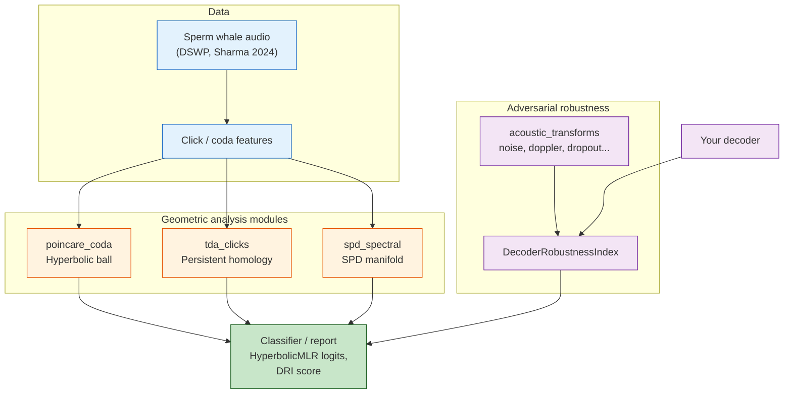

# eris-ketos

[](https://github.com/ahb-sjsu/eris-ketos/actions/workflows/ci.yaml)
[](https://pypi.org/project/eris-ketos/)
[](https://pypi.org/project/eris-ketos/)
[](https://opensource.org/licenses/MIT)
[](https://codecov.io/gh/ahb-sjsu/eris-ketos)

**Geometric analysis of cetacean communication.** Hyperbolic embeddings, topological data analysis, and adversarial robustness testing for whale vocalization decoding.

*ketos* (κῆτος) — Greek for "sea creature," the root of "cetacean."

Part of the [ErisML](https://github.com/ahb-sjsu/erisml-lib) family.

---

## Why geometry?

Sperm whale codas have a **combinatorial phonetic system** — rhythm, tempo, rubato, and ornamentation combine hierarchically ([Sharma et al., Nature Communications 2024](https://doi.org/10.1038/s41467-024-47221-8)). Standard ML treats these as flat feature vectors. But hierarchical structures embed naturally in **hyperbolic space** with exponentially less distortion than Euclidean space.

eris-ketos provides three geometric analysis methods and an adversarial robustness framework:

| Module | Method | What it captures |
|--------|--------|-----------------|
| `poincare_coda` | Poincaré ball embeddings | Hierarchical coda structure, taxonomic relationships |
| `tda_clicks` | Persistent homology | Topological shape of vocal attractors |
| `spd_spectral` | SPD manifold metrics | Spectral covariance ("vowel" patterns) |
| `decoder_robustness` | Adversarial fuzzing (DRI) | Decoder failure modes under acoustic perturbations |



## Installation

```bash
pip install eris-ketos            # core (numpy, scipy, torch, librosa)
pip install eris-ketos[tda]       # + ripser, persim
pip install eris-ketos[ml]        # + timm, torchaudio, scikit-learn
pip install eris-ketos[all]       # everything
```

## Quick start

```python
from eris_ketos import PoincareBall, HyperbolicMLR

# Embed coda features on the Poincaré ball
ball = PoincareBall(c=1.0)
coda_features = torch.randn(100, 32)  # 100 codas, 32-dim features
embeddings = ball.expmap0(coda_features * 0.1)

# Classify with hyperbolic distances to learned prototypes
classifier = HyperbolicMLR(embed_dim=32, num_classes=21, c=1.0)
logits = classifier(embeddings)
```

```python
from eris_ketos import compute_persistence, tda_feature_vector

# Topological analysis of click patterns
audio = librosa.load("sperm_whale_coda.wav", sr=32000)[0]
persistence = compute_persistence(audio, delay=10, dim=3)
features = tda_feature_vector(persistence)  # fixed-length topological summary
```

```python
from eris_ketos import DecoderRobustnessIndex, make_acoustic_transform_suite

# Test how robust a decoder is to acoustic perturbations
transforms = make_acoustic_transform_suite()
dri = DecoderRobustnessIndex(transforms)
score = dri.measure(decoder, codas)
print(f"Decoder Robustness Index: {score.dri:.4f}")
```

## Modules

### `poincare_coda` — Hyperbolic embeddings

Poincaré ball operations (exponential/logarithmic maps, Möbius addition, geodesic distance) and `HyperbolicMLR` for classification via distance to learned prototypes on the ball. Prototypes can be initialized from a taxonomic tree.

### `tda_clicks` — Topological data analysis

Time-delay embedding (Takens' theorem) reconstructs the vocal attractor from click sequences. Persistent homology (via ripser) computes topological features — connected components (H0) and loops (H1) — that distinguish coda types and social units.

### `spd_spectral` — SPD manifold analysis

Frequency-band covariance matrices are symmetric positive definite (SPD). The log-Euclidean Riemannian metric on this manifold is more discriminative than Euclidean distance for spectral patterns, capturing the "vowel-like" formant structure in whale clicks ([Begus et al., Open Mind 2025](https://doi.org/10.1162/OPMI.a.252)).

### `acoustic_transforms` — Parametric perturbations

Library of acoustic transforms with controllable intensity (0.0–1.0): additive noise, Doppler shift, multipath echo, time stretch, click dropout, conspecific overlay, and more. Supports compositional chains for compound distortion testing.

### `decoder_robustness` — Decoder Robustness Index (DRI)

Adapted from the [ErisML Bond Index](https://github.com/ahb-sjsu/erisml-lib) adversarial fuzzing framework. Measures decoder reliability via graduated semantic distance, adversarial threshold search, sensitivity profiling, and compositional chain analysis.

## Data

eris-ketos works with the [DSWP dataset](https://huggingface.co/datasets/orrp/DSWP) (1,501 annotated sperm whale codas, CC BY 4.0) — the same data behind the Sharma et al. 2024 Nature paper.

```python
from eris_ketos.data import load_dswp
codas = load_dswp()  # downloads from HuggingFace on first call
```

## References

- Sharma, P. et al. "Contextual and combinatorial structure in sperm whale vocalisations." *Nature Communications* 15, 3617 (2024).
- Begus, G. et al. "Vowel- and diphthong-like spectral patterns in sperm whale codas." *Open Mind* (MIT Press, 2025).
- Project CETI — WhAM. *NeurIPS 2025.*
- Bond, A.H. "ErisML: Geometric ethics framework." [erisml-lib](https://github.com/ahb-sjsu/erisml-lib).

## License

MIT
